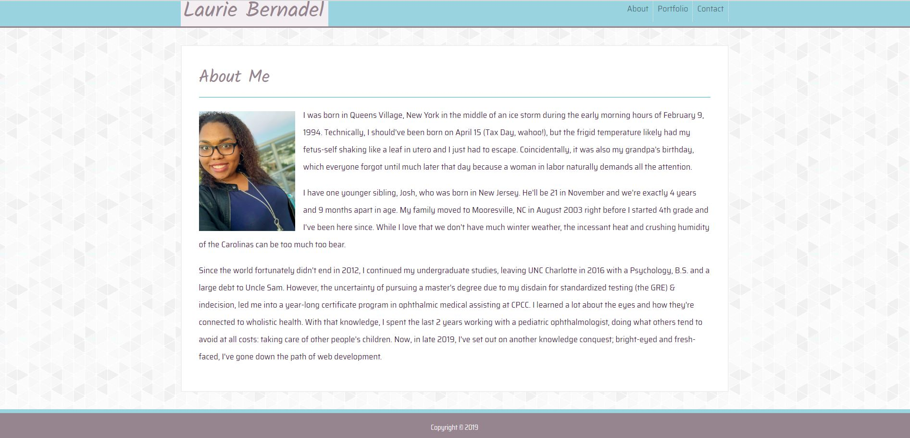

# [Bootstrap Responsive Portfolio](https://lbernadel.github.io/Bootstrap-Responsive-Portfolio/)

## Description
The purpose of this project was to re-create the first version of the site I made in [this repo](https://github.com/lbernadel/lbernadel.github.io) to showcase the work I will make during the Trilogy Edu. Coding Bootcamp, implementing the Bootstrap Framework. This time, with the added liberty of altering typography styling and thematic color schemes. In addition to the concepts covered during Week 1, I had to consider the new concepts of Bootstrap and media queries.

A secondary task was to practice using GitHub to clone repositories and push changes from my device to GitHub as to update my webpage.

## Challenges
My main challenge was reversed this time, surprisingly. Bootstrap definitely makes laying out the content simpler. However, trying to override the correct area of the Bootstrap framework to create the thematic changes I desired was much more difficult and time consuming; the documentation was confusing for the simplest portions of what I wanted to alter. Other challenges include attempting to understand the sources on media queries I used to figure out that portion and again, the struggle of ignoring my perfectionist nature.

### Sources
Google is my best friend. It's probably yours too. It helped me find these lifesaving resources during my times of struggle and frustration:

- The NavBar Challenge
  - The Invisible Toggler: [Bootstrap 4 NavBar Toggler Icon Color](https://www.codeply.com/go/n8TxnQYuUv/bootstrap-4-custom-navbar-toggler-icon-color)
  - NavBar Item Positions: [Bootstrap 4 New NavBar](https://www.codeply.com/go/qhaBrcWp3v)
- [Image Overlay](https://getbootstrap.com/docs/4.1/components/card/#image-overlays)